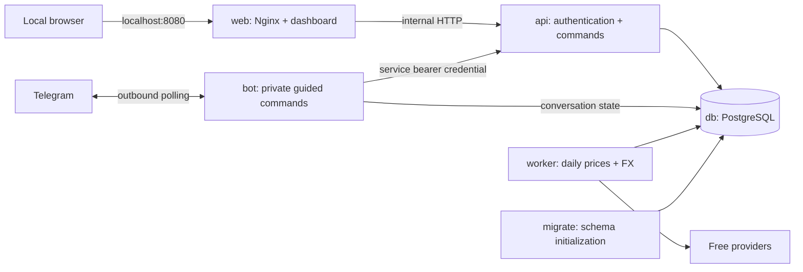

# Container architecture and data design

This describes the implemented first release. The web UI uses plain JavaScript and CSS, served by Nginx; the backend uses Python 3.12, FastAPI, SQLAlchemy, and PostgreSQL. A frontend build tool is unnecessary for these screens. Asset forms can call the same command API later.

## Containers and network

| Service | Image/entry point | Responsibility |
|---|---|---|
| `web` | `financial-planner-web:local` | Static screens, same-origin `/api` proxy, security headers |
| `api` | `financial-planner-backend:local`, `app.api_server.main:app` | Owner sessions, validation, atomic commands, dashboard views |
| `bot` | Same backend image, `python -m app.telegram_bot` | Owner checks, guided prompts, confirmations, polling, durable replies |
| `worker` | Same backend image, `python -m app.core.worker` | Exchange-session checks, daily OHLC prices, daily reference FX |
| `migrate` | Same backend image, `python -m app.core.store` | Idempotent version-1 schema initialization; exits on success |
| `db` | `postgres:17.4-alpine` | Persistent application state |

Only web port 8080 is published, bound to `127.0.0.1`. All backend/database traffic stays on the Compose network. Telegram uses outbound polling; no public webhook or remote web access is configured.

The backend image contains three explicit package boundaries. `app.api_server`
owns HTTP authentication, routes, and response mapping. `app.telegram_bot` owns
Telegram polling, handlers, conversation state, callbacks, and formatting.
`app.core` owns reusable domain rules, schemas, persistence, projections, market
providers, and background work. Core never imports either process package, and
the API and bot do not import one another. Legacy top-level module names remain
temporary import aliases for existing callers; deployed entry points use the
canonical packages above.

Compose waits for PostgreSQL health, runs migration successfully, then starts the API. Web, bot, and worker wait for API health. Bot and worker have process supervision; only API/web/database have active health probes. PostgreSQL uses the `planner-data` named volume. Normal container recreation retains all data.

## Storage and transaction model

The first release deliberately uses one PostgreSQL `planner_state` row with a `schema_version` and a JSON aggregate. This replaces the earlier proposal for several normalized tables. For a single user it allows all related financial operations, idempotency receipts, and derived-balance validation to commit atomically with a small implementation.

Every writer locks the row using `SELECT ... FOR UPDATE`, copies its state, validates a change, and writes the new aggregate within one SQL transaction. Network requests never occur while holding the database lock. Failed validation rolls back every part of the operation. Concurrent API and worker writes cannot overwrite one another's changes.

The aggregate contains:

- `accounts`: stable IDs, names, account type, default currency, CPF subtype, archive flag.
- `events`: financial transactions, effective dates, deterministic ordering, original payloads, channel, status, and replacement links.
- `loans`: opening principal/interest, monthly installment, due-date anchor, and effective-dated rates.
- `prices` / `fx`: cached daily values, source, dates, retrieval timestamps, and staleness information.
- `receipts`: immutable submitted command/payload/result records keyed by actor plus idempotency key; administrative changes also appear here.
- `bot`: processed update offset, active guided conversation, and pending reply.
- `revision` / `provider_status`: dashboard refresh and source availability metadata.

Decimal quantities, cash, unit prices, rates, and interest are stored as strings and calculated using Python `Decimal`. Browser numbers are used only for display/chart percentages. Money rounding for loan postings is explicit half-up to cents. Unit quantities and trade inputs allow at most ten decimal places.

This aggregate is not intended for multiple users or very large histories: replay and full-document writes grow with history. A future schema migration can split accounts/events into tables while preserving the command API. SQLite is used only in isolated unit tests; deployed persistence uses PostgreSQL.

## Ledger rules

`domain.py` is independent of HTTP, Telegram, and the database. Events replay by effective date and stable order. A correction retains its predecessor's ordering, marks the old record superseded, and appends a linked replacement. Cancellation marks an entry void. Original entries and operation receipts remain available for audit.

- Opening cash/holdings establish the starting position; opening holdings do not deduct cash.
- Buys deduct quantity times unit price from brokerage cash; sells credit proceeds.
- Transfers contain both accounts, both currency amounts, and the derived actual FX rate with direction.
- CPF reconciliation stores a target balance. Replay derives the adjustment necessary at that date, including after corrections to earlier history.
- Manual splits multiply position quantity without changing cash.
- Repayments deduct all source allocations together, and loan calculations allocate the actual payment between interest and principal.
- Credit-card purchases and refunds retain their card identity. The parent account's combined SGD balance is derived from purchases minus refunds and payments. Card payments also deduct SGD cash from their selected non-CPF funding account.

Every new event or correction replays the affected financial history before commit. Any negative balance at any point is rejected. Archived accounts must stay empty. Corporate actions are manual; changing a ticker or exchange through provider data never silently changes quantities.

Account display names are unique. Instruments use exchange-qualified symbols (`NASDAQ:AAPL`, `NYSE:VOO`, `LSE:VWRA`, `SGX:D05`) with a consistent asset class and trading currency. This prevents different trading lines from being merged accidentally.

The `instrument_catalog` relational table is separate from the locked ledger JSON. It stores exchange, symbol, name, class, currency, native venue, source, active state, and refresh timestamp. The worker atomically replaces official US bulk rows daily. Verified LSE and SGX lookups are cached individually. Keeping the catalogue outside the aggregate prevents every financial write from copying thousands of listing records.

The derived `portfolio_history` table stores daily brokerage value, raw change, external flow, and cash-flow-adjusted change in SGD. The worker rebuilds it from the immutable event history plus historical close and FX series. It can therefore be regenerated without changing the financial ledger. Missing historical price or FX data suppresses incomplete account-day snapshots rather than treating an asset as zero.

The `stock_cache` table stores normalized successful Stocks query responses by
canonical security ID and response kind. Provider calls occur outside ledger
transactions. Fresh entries avoid repeat calls; expired entries remain available
as explicitly stale fallback data after transient provider failures.

## Command and query API

All endpoints require an owner session or the private bot bearer credential, apart from login and health.

Every command payload is parsed through a command-specific Pydantic model with unexpected fields forbidden. Pydantic checks the external request shape and nested structures before a database transaction starts; `domain.py` then applies state-dependent financial rules using exact `Decimal` calculations.

| Endpoint | Behavior |
|---|---|
| `POST /api/login`, `POST /api/logout`, `GET /api/session` | Local password login, signed HttpOnly session, CSRF token |
| `GET /api/revision` | Current data revision and local date |
| `GET /api/dashboard` | Accounts, balances, holdings, allocation, valuations, loans, schedules, audit-facing transaction history |
| `POST /api/calculators/time-value` | Authenticated stateless present/future-value calculation with optional period schedule |
| `GET /api/stocks/search` | Ticker search with optional exchange filter and canonical security IDs |
| `GET /api/stocks/{security_id}/identity` | Resolve a canonical instrument identity for internal command clients |
| `GET /api/stocks/{security_id}/overview` | Latest completed-session price and backend-computed prior-session change |
| `GET /api/stocks/{security_id}/candles` | Completed daily OHLCV candles for validated ranges |
| `GET /api/stocks/{security_id}/financials` | Up to five completed fiscal years of normalized core metrics |
| `GET /api/stocks/{security_id}/earnings/latest` | Latest completed quarterly statement, with annual fallback |
| `POST /api/commands/{command}` | Shared business operations; requires `Idempotency-Key` |

Commands are `account_add`, `account_archive`, `opening_cash`, `opening_holding`, `deposit`, `withdraw`, `buy`, `sell`, `transfer`, `cpf_set`, `split`, `correct`, `void`, `loan_add`, `loan_rate`, and `repayment`. The bot cannot create loans, change rates, post repayments, or correct/cancel repayments. These restrictions are enforced by the API domain layer, not merely hidden in the Telegram menu.

The time-value endpoint accepts a present- or future-value mode, a lump sum or target,
a signed recurring cash flow, annual nominal percentage rate, duration in years and
months, cash-flow and compounding frequencies, and beginning/end timing. Its decimal
results are JSON strings so clients do not lose precision; clients round monetary
values only for display. Present-value mode interprets `initial_value` as the desired
terminal value and returns the starting value needed after accounting for recurring
cash flows. Both browser and bot use this endpoint, and browser calls require CSRF.
For allocations with different returns, callers may replace the flat amount/rate
fields with up to 20 named `streams`. Each stream has its own lump sum or terminal
target, recurring cash flow, return, timing, and frequencies while sharing the
overall duration. The response includes aggregate totals and a full result and
schedule for every stream. An aggregate effective annual rate is deliberately
omitted because it would be misleading across independently compounded returns.
Each stream may also set `cashflow_start_month` and `cashflow_duration_months`.
Only the recurring cash flow is limited by that window: the stream's opening
value and all accumulated returns continue compounding through the shared overall
duration. Windows must align with the selected cash-flow frequency, which keeps
beginning/end timing unambiguous.

The browser exposes forms only for loan creation, rate additions, repayments, and repayment corrections/cancellations. Other web editing can be added using the existing commands. Account/transaction validation is not duplicated in the frontend.

## Dashboard and valuations

The browser checks the revision every five seconds while visible, refreshing data after a revision/date change and on focus. Dialog fields remain outside the refreshed page content. Network failures keep the last view and show offline status.

Cash is shown by currency. Investment market value is quantity times the most recent usable completed-session close; its high/low midpoint is informational. The overview converts values to SGD using current recorded daily FX. Transfer FX is historical and never substituted for current valuation FX.

CPF maps to its own asset class and is not counted again as cash. Loans are liabilities, not negative pie slices. Net worth subtracts principal and accrued unpaid interest from assets. Property assets remain excluded even when an HDB liability is present.

Unpriced holdings and missing FX make totals explicitly incomplete rather than silently worth zero. Price dates, provider failures, and stale values are visible. A CPF warning appears one calendar month after its opening/reconciliation date; ordinary deposits and withdrawals do not count as a statement reconciliation.

## Free price and FX adapters

`worker.py` orchestrates refresh jobs. Stock and ETF quotes use the
`StockPriceProvider` interface in `providers.py`; the
`StockPriceProviderFactory` selects the configured implementation. The first
implementation is Yahoo. Adding another quote source requires a provider class
and one factory registration rather than changes throughout the worker.

The provider implementations use:

- [exchange_calendars](https://github.com/gerrymanoim/exchange_calendars) for XNYS, XLON, and XSES sessions, holidays, early closes, and timezone-aware boundaries.
- [Nasdaq Trader Symbol Directory](https://www.nasdaqtrader.com/Trader.aspx?id=SymbolDirDefs) for daily US listing catalogue refreshes.
- [yfinance](https://ranaroussi.github.io/yfinance/reference/api/yfinance.download.html) with `auto_adjust=False` to retrieve daily OHLC and verify uncached instruments. London symbols map to `.L`, Singapore symbols to `.SI`, and GBp quotes are converted to GBP after validating trading currency.
- [Frankfurter v2](https://frankfurter.dev/) for free daily currency-to-SGD reference rates.

The worker waits 30 minutes after a session closes, chooses only daily rows dated no later than that completed session, validates OHLC/currency, and stores source and retrieval timestamps. It polls every fifteen minutes by default. Provider failure retains the previous quote. There is no guaranteed provider finality flag: this is a conservative completed-session daily bar, not a claim of exchange-certified official closing-price data. Delayed or revised provider data may change a later refresh.

Quote/FX refreshes, US catalogue refreshes, and brokerage-history rebuilds have independent schedules and failure boundaries. A provider failure cannot prevent the other jobs from running. Failed scheduled jobs retain prior data and wait for their full configured interval before retrying.

Prices refresh on startup and the periodic cycle; recording a new symbol may therefore wait until the next cycle for its first price. Historical portfolio performance and historical FX valuation are not implemented. The latest OHLC cache is not a full market-data warehouse.

## HDB interest and schedules

HDB's published monthly-rest basis uses the principal outstanding at the start of the month and the annual rate divided by twelve. The concessionary rate is linked to CPF OA and may change; this application stores manually entered effective-dated rates rather than hard-coding a permanent rate. See [HDB interest rules](https://www.hdb.gov.sg/managing-my-home/finances/loan-matters/interest-rate).

Enter an end-of-day opening snapshot with principal and already-accrued unpaid interest. New monthly interest begins on the first of the next month. Within each month, the month's interest accrual is ordered before repayments on the first day. Interest is rounded half-up to cents; payments settle unpaid interest first. No interest is charged on unpaid interest. Confirm these conventions against your statement.

Projected schedules simulate the entered installment from the next upcoming anchored due date. Extra actual repayments reduce principal and therefore the projected term. Generation does not post payments. Future rate entries affect projection from their effective month. Projections stop after 600 payments and flag loans that do not clear within that horizon.

Current schedules are calculated on read, not stored as separate version snapshots. Original terms/rate commands remain in audit receipts. Rate additions and repayment corrections revalidate the existing history. Exact lender reconciliation, late penalties, initial partial-month origination interest, term edits, and alternate loan models are not implemented.

## Security and privacy

The local password is PBKDF2-SHA256 hashed with a unique salt. Sessions expire after twelve hours, are HttpOnly and SameSite Strict, and all browser mutations validate both Origin and CSRF token. Login attempts are rate-limited in the single API process. The loopback deployment uses HTTP; remote deployment would need a separate HTTPS/access design.

Telegram compares numeric sender and private chat IDs before reading data. Pending replies and conversation state persist. The bot and worker are trusted internal services with database access; the service-credential restriction is an API boundary, not a defense against a compromised internal container. Only the API receives session/password settings; only the bot receives the Telegram token.

Images exclude `.env`, and backend/web processes run as non-root users. Logs avoid credentials and financial message payloads. The first release uses one PostgreSQL application role for schema and data; finer database role separation remains a future hardening step.

## Tests

Containerized tests cover balances, opening holdings, transfers, duplicate requests, invalid decimals, CPF reconciliation, corrections, archive invariants, loan interest and schedules, split funding, access control, CSRF, private bot updates, holidays, and early closes. A separate Compose smoke test verifies PostgreSQL concurrency and rollback. See [validation](validation.md) for the completed checks and limits.
